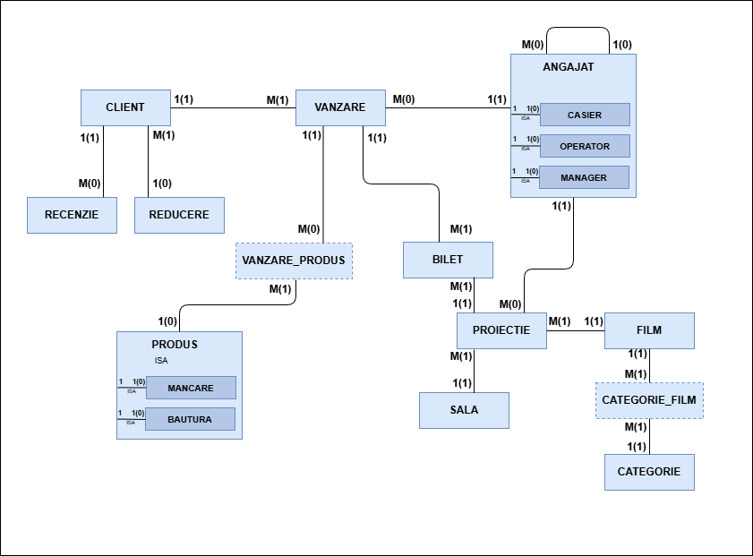
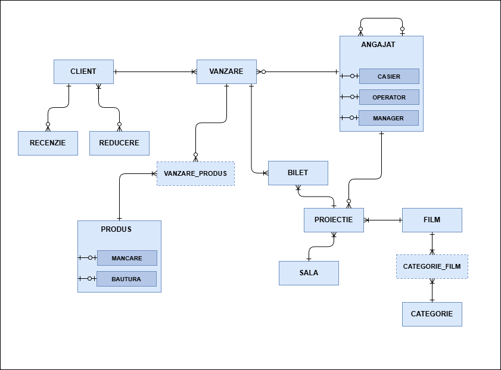

# Cinematograf
O aplicație pentru gestionarea unui cinematograf oferă administratorilor și angajaților posibilitatea de a gestiona eficient programul proiecțiilor, vânzările de bilete și stocurile de la bar. Sistemul centralizează informațiile despre filme, distribuitori și clienți, asigurând o experiență fluidă pentru utilizatorul final.

Fiecare film este identificat printr-un cod unic și are completată o fișă tehnică ce cuprinde titlul, durata și rating-ul de vârstă. De asemenea, pentru o mai bună organizare, filmele sunt grupate pe categorii.

Cinematograful dispune de mai multe săli de proiecție, fiecare având o capacitate maximă de locuri și dotări tehnice specifice (2D, 3D, IMAX). Prețul biletelor variază în funcție de tehnologia sălii selectate și de categoria de client.

Suplimentar achiziției de bilete, clienții pot cumpăra produse de la bar. Acestea sunt gestionate ca unități individuale (popcorn, băuturi) sau sub formă de meniu, oferind prețuri avantajoase.

Compania are angajați organizați ierarhic. Există manageri care coordonează activitatea și aprobă programul proiecțiilor, casieri care se ocupă de interacțiunea directă cu clienții și operatori care se ocupă de gestionarea proiecțiilor. Orice angajat (cu excepția directorului general) este subordonat unui manager direct.

Reguli de funcționare:
- Proiecția reprezintă elementul central și este definită de triada: Film, Sală și Operatorul care a programat evenimentul la o anumită dată și oră.
- Un bilet nu poate fi emis fără a fi asociat unei proiecții valide și unui client înregistrat.
- Clienții au posibilitatea de a lăsa recenzii pentru filmele vizionate.
- Vânzările la bar sunt înregistrate de către casieri, menționându-se cantitatea pentru fiecare produs sau meniu vândut, pentru a asigura scăderea automată din stoc.
- Un film poate fi asociat mai multor categorii simultan, permițând o filtrare avansată în catalogul cinematografului.

